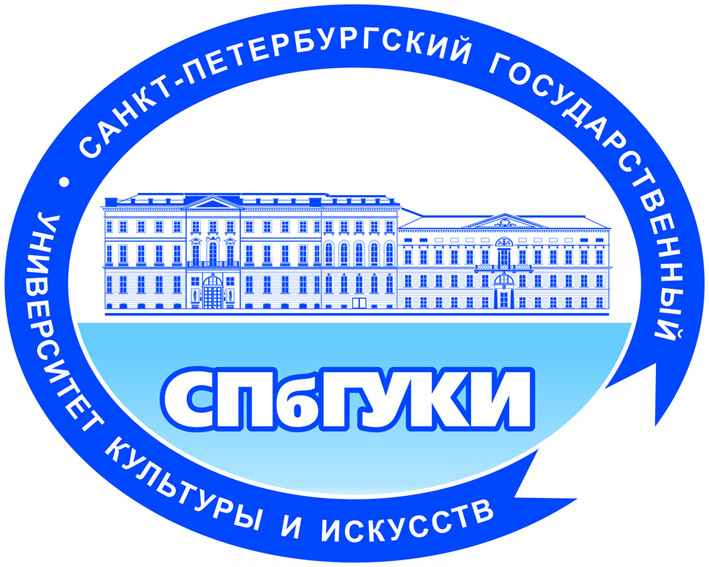
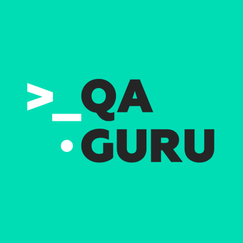

### Привет! 👋
Меня зовут Константин. Я работаю QA инженером с 2022 года.

### Образование и курсы

<table width="100%" border='0'>
    <tr><td width="30%" valign="bottom"></td><td valign="middle">Санкт-Петербургский государственный университет культуры и искусств. Факультет прикладной информатики в менеджменте.</td></tr>
    <tr><td width="30%" valign="bottom"></td><td valign="middle">QA Guru. Автоматизация тестирования на Python.</td></tr>
    <tr><td width="30%" valign="bottom"></td><td valign="middle">Stepik. Автоматизация тестирования с помощью Selenium и Python. <a target="_blank" href="https://stepik.org/cert/2005306">Сертификат.</a></td></tr>
    <tr><td width="30%" valign="bottom"></td><td valign="middle">Stepik. Программирование на Python. <a target="_blank" href="https://stepik.org/cert/1935035">Сертификат.</a></td></tr>
    <tr><td width="30%" valign="bottom"></td><td valign="middle">Stepik. Python: основы и применение. <a target="_blank" href="https://stepik.org/cert/1988994">Сертификат.</a></td></tr>
    <tr><td width="30%" valign="bottom"></td><td valign="middle">Яндекс. QA Engineer.</td></tr>
</table>
   